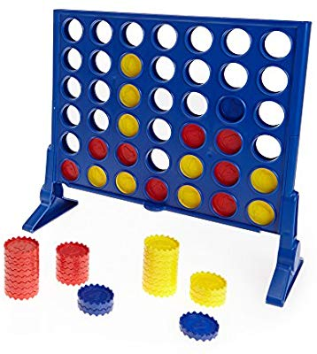

# Minimax with Connect Four



 ### Introduction

In this assignment you will implement the minimax adversarial search algorithm on the game of Connect Four. The game is played on an 8x8 board of red and black pieces. For us, we'll use $n=8$. 

Like the BFS and 8-puzzle assignments, begin early. Be familiar with setting breakpoints and debugging in Python.

Before coding, first recall the basic minimax algorithm:

```
max-value(state):
if state is a completed game, return its utility
otherwise return the opponent's max(min-value(child)) over all children of state
```

```
min-value(state):
if state is a completed game, return its utility
otherwise return the opponent's min(max-value(child)) over all children of state
```

## Implementation

A (ConnectFour) `Game` class and an abstract `Agent` class have been started for you below. In addition to implementing the skelton method in `Game`, you'll define three agents that extend the abstract `Agent`:

1. a naive `FirstMoveAgent` agent who always select the first possible move considered

2. a naive `RandomAgent` agent who selects a move at random out of those that are possible

3. an "intelligent" `MinimaxAgent` which takes advantage of the minimax algorithm. Coupled with a utility function that you'll need to define, this minimax agent should be able to consistenly beat either of the naive agents.

Once you complete the indicated methods, you will be able to watch agents play the connect four game. Adjust the height of your console window to match the puzzle height, so that each display appears in the same place.

Begin by getting everything working with the `FirstMoveAgent` and `RandomAgent`, then start coding the `MinimaxAgent`.

**Python notes:**

* The values of `float('inf')` and `float(-inf)`represent mathematical infinity and -infinity.


## Autograding / Testing

Keep your Connect Four implementation program named `minimax_connectfour.py`. 

The functions that I'll be testing:

1. `possible_moves`(3 x 5 pts = 15 pts)
2. `neighbor`(3 x 5 pts = 15 pts)
3. `winning_state` (6 x 5 pts = 30 pts)
4. `tournament`(40 pts)
	* Tests whether your minimax agent outperforms a random agent. CSC481 students need their minimax agent to win 70% of games against a random agent.
	* **CSC575: ** must win 85% of games.
	* Partial credit may be awarded if you are short of the threshold.

The pytest methods are located in `connectfour_tester.py`. Execute the pytests the same as HW0. Feel free to 
include additional tests as long as you don't overwrite my original tests.

## Submission Instructions

Submit this assignment by pushing/committing into our GitHub organization, exactly like HW 0. 
Test your project locally 
using pytest before pushing/committing. You may push/commit multiple times. Look at the Actions report on the 
repository to double check the most recent result of the unit tests.